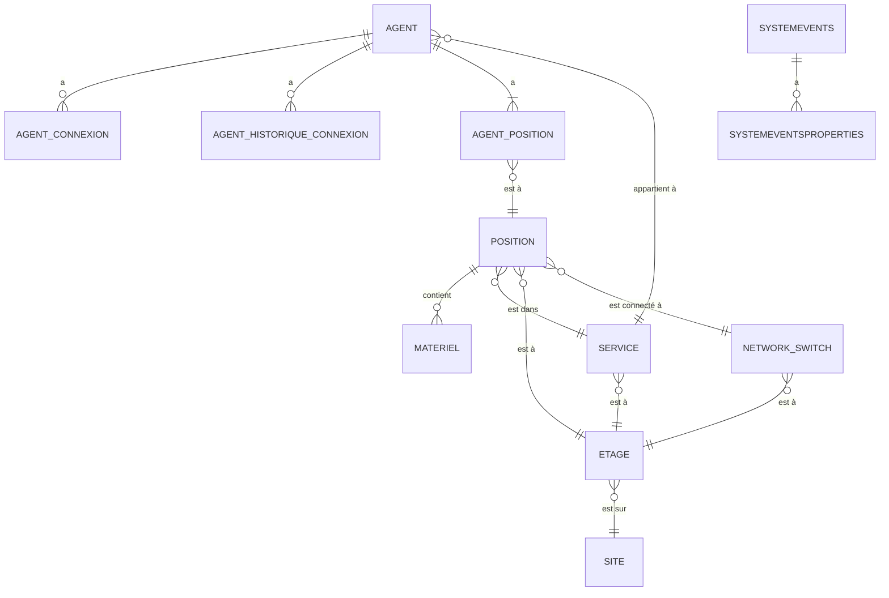

# Documentation Technique Complète du Projet Téhou

## 1. Vue d'ensemble

Ce document est le guide technique complet du projet Téhou. Il a pour but de fournir une compréhension approfondie de l'architecture, du fonctionnement et de la maintenance de l'application.

Téhou est une application Symfony 5.4 conçue pour suivre en temps réel la position des agents sur différents sites. Elle se compose d'un serveur backend qui centralise les informations et d'un client Windows (non couvert par ce document) qui communique avec le serveur.

L'objectif principal de l'application est de fournir une vue d'ensemble de la localisation des agents, de gérer leur statut de connexion (en ligne, hors ligne, en télétravail) et de maintenir un historique de leurs positions.

## 2. Architecture technique

L'application Téhou est construite sur la base du framework Symfony 5.4 en mode console. Elle n'expose aucune interface web et fonctionne exclusivement à travers des commandes et des services.

### 2.1. Composants principaux

*   **Symfony Console**: Le cœur de l'application, utilisé pour exécuter des tâches en ligne de commande.
*   **Doctrine ORM**: Utilisé pour la persistance des données et la gestion de la base de données.
*   **Symfony Messenger**: Utilisé pour la gestion des tâches asynchrones, comme le nettoyage des connexions expirées.
*   **Symfony Lock**: Utilisé pour éviter les conflits d'accès concurrentiels lors du traitement des données sensibles.

### 2.2. Flux de données

```
+----------------+      +------------------+      +-----------------+
| Client Windows |----->|   API REST (non  |----->| Serveur Symfony |
+----------------+      |  documentée ici) |      +-----------------+
                          +------------------+
                                                     |
                                                     | 1. Réception des données
                                                     |
                                           +---------v---------+
                                           | `PositionService` |
                                           +-------------------+
                                                     |
                                                     | 2. Détermination du type de connexion
                                                     |
                               +---------------------v---------------------+
                               | `SyslogService` (si connexion sur site) |
                               +-----------------------------------------+
                                                     |
                                                     | 3. Analyse des logs syslog
                                                     |
                                           +---------v---------+
                                           |  Base de données  |
                                           +-------------------+
                                                     |
                                                     | 4. Stockage des données
                                                     |
+----------------------------------+       +---------v---------+
| Tâche planifiée (cron)           |------>| `tehou:dispatch-clean-connections` |
+----------------------------------+       +-------------------+
                                                     |
                                                     | 5. Nettoyage des connexions
                                                     |
                                           +---------v---------+
                                           |  Base de données  |
                                           +-------------------+
```

## 3. Client Windows

Le client Windows est une application développée en dehors de ce projet. Il est responsable de la collecte des informations de l'agent et de leur envoi au serveur Symfony. La communication entre le client et le serveur se fait via des appels HTTP POST vers une API REST (non documentée ici).

## 4. Serveur Symfony

Le serveur Symfony est le cœur de l'application. Il est responsable de la réception des données du client, de leur traitement et de leur stockage en base de données.

### 4.1. Structure du projet

```
src/
├── Command/
│   └── DispatchCleanConnectionsCommand.php
├── Data/
│   ├── noms.txt
│   └── prenoms.txt
├── DependencyInjection/
│   ├── Configuration.php
│   └── TehouExtension.php
├── Entity/
│   ├── Agent.php
│   ├── AgentConnexion.php
│   ├── AgentHistoriqueConnexion.php
│   ├── AgentPosition.php
│   ├── Config.php
│   ├── Enum/
│   │   └── TypeConnexion.php
│   ├── Etage.php
│   ├── Materiel.php
│   ├── NetworkSwitch.php
│   ├── Position.php
│   ├── Service.php
│   ├── Site.php
│   ├── Systemevents.php
│   └── Systemeventsproperties.php
├── Message/
│   └── CleanConnections.php
├── MessageHandler/
│   └── CleanConnectionsHandler.php
├── Repository/
│   ├── ... (tous les repositories)
└── Service/
    ├── ArchitectureService.php
    ├── PositionService.php
    ├── Syslog/
    │   ├── ... (exceptions)
    └── SyslogService.php
```

### 4.2. Commandes console

L'application expose une commande console personnalisée :

*   **`tehou:dispatch-clean-connections`**: Cette commande envoie un message `CleanConnections` dans le bus de messages de Symfony. Ce message est ensuite traité de manière asynchrone par le `CleanConnectionsHandler` pour nettoyer les connexions expirées.

## 5. Base de données

La base de données est gérée par Doctrine ORM. Le schéma est défini à l'aide d'attributs PHP 8 dans les classes d'entités.

### 5.1. Schéma de la base de données



### 5.2. Description des entités

#### `Agent`
*   **Description**: Représente un utilisateur de l'application.
*   **Propriétés**: `numagent` (PK), `service`, `civilite`, `prenom`, `nom`.
*   **Relations**:
    *   `service`: ManyToOne avec `Service`.
    *   `agentPosition`: OneToOne avec `AgentPosition`.
    *   `agentHistoriqueConnexions`: OneToMany avec `AgentHistoriqueConnexion`.
    *   `agentConnexions`: OneToMany avec `AgentConnexion`.

#### `AgentConnexion`
*   **Description**: Stocke les informations de connexion actuelles d'un agent.
*   **Propriétés**: `id` (PK), `agent`, `type`, `ip`, `mac`, `dateconnexion`, `dateactualisation`.
*   **Relations**:
    *   `agent`: ManyToOne avec `Agent`.

#### `AgentHistoriqueConnexion`
*   **Description**: Archive les anciennes connexions des agents.
*   **Propriétés**: `id` (PK), `agent`, `position`, `jour`, `dateconnexion`, `datedeconnexion`.
*   **Relations**:
    *   `agent`: ManyToOne avec `Agent`.
    *   `position`: ManyToOne avec `Position`.

#### `AgentPosition`
*   **Description**: Lie un agent à une position physique à un instant T.
*   **Propriétés**: `agent` (PK, FK), `position` (FK), `jour`, `dateconnexion`, `dateexpiration`.
*   **Relations**:
    *   `agent`: OneToOne avec `Agent`.
    *   `position`: OneToOne avec `Position`.

#### `Config`
*   **Description**: Table de configuration clé-valeur pour les paramètres de l'application.
*   **Propriétés**: `cle` (PK), `valeur`, `date_maj`.

#### `Etage`
*   **Description**: Représente un étage dans un bâtiment.
*   **Propriétés**: `id` (PK), `site`, `nom`, `arriereplan`, `largeur`, `hauteur`.
*   **Relations**:
    *   `site`: ManyToOne avec `Site`.
    *   `services`: OneToMany avec `Service`.
    *   `switches`: OneToMany avec `NetworkSwitch`.
    *   `positions`: OneToMany avec `Position`.

#### `Materiel`
*   **Description**: Représente le matériel informatique associé à une position.
*   **Propriétés**: `id` (PK), `position`, `type`, `special`, `codebarre`.
*   **Relations**:
    *   `position`: ManyToOne avec `Position`.

#### `NetworkSwitch`
*   **Description**: Représente un commutateur réseau.
*   **Propriétés**: `id` (PK), `etage`, `nom`, `coordx`, `coordy`, `nbprises`.
*   **Relations**:
    *   `etage`: ManyToOne avec `Etage`.
    *   `positions`: OneToMany avec `Position`.

#### `Position`
*   **Description**: Représente un poste de travail physique.
*   **Propriétés**: `id` (PK), `etage`, `service`, `networkSwitch`, `coordx`, `coordy`, `prise`, `mac`, `type`, `sanctuaire`, `flex`.
*   **Relations**:
    *   `etage`: ManyToOne avec `Etage`.
    *   `service`: ManyToOne avec `Service`.
    *   `networkSwitch`: ManyToOne avec `NetworkSwitch`.
    *   `materiels`: OneToMany avec `Materiel`.
    *   `agentPosition`: OneToOne avec `AgentPosition`.

#### `Service`
*   **Description**: Représente un service ou un département de l'organisation.
*   **Propriétés**: `id` (PK), `etage`, `nom`.
*   **Relations**:
    *   `etage`: ManyToOne avec `Etage`.
    *   `agents`: OneToMany avec `Agent`.
    *   `positions`: OneToMany avec `Position`.

#### `Site`
*   **Description**: Représente un site géographique.
*   **Propriétés**: `id` (PK), `nom`, `flex`.
*   **Relations**:
    *   `etages`: OneToMany avec `Etage`.

#### `Systemevents`
*   **Description**: Table brute pour stocker les événements syslog.
*   **Propriétés**: `id` (PK), `customerid`, `receivedat`, `devicereportedtime`, `facility`, `priority`, `fromhost`, `message`, `ntseverity`, `importance`, `eventsource`, `eventuser`, `eventcategory`, `eventid`, `eventbinarydata`, `maxavailable`, `currusage`, `minusage`, `maxusage`, `infounitid`, `syslogtag`, `eventlogtype`, `genericfilename`, `systemid`.
*   **Relations**:
    *   `systemeventsproperties`: OneToMany avec `Systemeventsproperties`.

#### `Systemeventsproperties`
*   **Description**: Stocke les propriétés additionnelles des événements syslog.
*   **Propriétés**: `id` (PK), `systemevent`, `paramname`, `paramvalue`.
*   **Relations**:
    *   `systemevent`: ManyToOne avec `Systemevents`.

### 5.3. `TypeConnexion` (Enum)
*   **Description**: Enumération des types de connexion possibles.
*   **Valeurs**: `SITE`, `TELETRAVAIL`, `WIFI`.

## 6. Correspondance MAC/Position

La correspondance entre l'adresse MAC d'un agent et sa position physique est un élément central de l'application. Ce processus est géré par le `SyslogService`.

1.  Le service lit les événements syslog en provenance des commutateurs réseau.
2.  Il utilise des expressions régulières pour extraire l'adresse MAC et le port de connexion du message syslog.
3.  Il recherche le commutateur réseau dans la base de données à partir du nom du commutateur (présent dans le tag syslog).
4.  Il met à jour l'entité `Position` correspondante avec l'adresse MAC de l'agent.

## 7. Interfaces utilisateur

Il n'y a pas d'interface utilisateur graphique dans ce projet. L'interaction avec l'application se fait principalement via la ligne de commande.

## 8. Attributs PHP 8+ et annotations

L'application utilise abondamment les attributs PHP 8 pour la configuration de Doctrine et de Symfony.

### Exemples d'attributs :

*   **`#[ORM\Entity]`**:
    ```php
    #[ORM\Entity(repositoryClass: AgentRepository::class)]
    class Agent
    {
        // ...
    }
    ```
*   **`#[ORM\Column]`**:
    ```php
    #[ORM\Column(length: 100)]
    private ?string $nom = null;
    ```
*   **`#[AsCommand]`**:
    ```php
    #[AsCommand(
        name: 'tehou:dispatch-clean-connections',
        description: 'Dispatches a message to clean expired connections.',
    )]
    class DispatchCleanConnectionsCommand extends Command
    {
        // ...
    }
    ```
*   **`#[AsMessageHandler]`**:
    ```php
    #[AsMessageHandler]
    class CleanConnectionsHandler
    {
        // ...
    }
    ```
*   **`#[ORM\Id]`**:
    ```php
    #[ORM\Id]
    #[ORM\GeneratedValue]
    #[ORM\Column]
    private ?int $id = null;
    ```
*   **`#[ORM\ManyToOne]`**:
    ```php
    #[ORM\ManyToOne(inversedBy: 'agents')]
    #[ORM\JoinColumn(nullable: false)]
    private ?Service $service = null;
    ```
*   **`#[ORM\OneToOne]`**:
    ```php
    #[ORM\OneToOne(mappedBy: 'agent', cascade: ['persist', 'remove'])]
    private ?AgentPosition $agentPosition = null;
    ```
*   **`#[ORM\OneToMany]`**:
    ```php
    #[ORM\OneToMany(mappedBy: 'agent', targetEntity: AgentHistoriqueConnexion::class)]
    private Collection $agentHistoriqueConnexions;
    ```
*   **`#[ORM\JoinColumn]`**:
    ```php
    #[ORM\JoinColumn(name: 'numagent', referencedColumnName: 'numagent', nullable: false)]
    private ?Agent $agent = null;
    ```
*   **`#[ORM\Table]`**:
    ```php
    #[ORM\Table(name: '`network_switch`')]
    class NetworkSwitch
    {
        // ...
    }
    ```

## 9. Configuration Symfony détaillée

La configuration de l'application est répartie dans plusieurs fichiers YAML dans le répertoire `config/`.

*   **`services.yaml`**: Configure les services de l'application.
*   **`doctrine.yaml`**: Configure la connexion à la base de données et les mappings Doctrine.
*   **`messenger.yaml`**: Configure les bus de messages et les transports.
*   **`tehou.yaml`**: Fichier de configuration personnalisé pour l'application.

### 9.1. `tehou.yaml`

Ce fichier contient la configuration spécifique à l'application Téhou.

```yaml
tehou:
    syslog:
        batch_size: 1000
        max_processing_time: 300 # 5 minutes max
        max_errors: 100
        regex_patterns:
            connection:
                - '/port\s+(\w+\/\d+\/\d+).*port\s+ID\s+is\s+([\w-]+)/'
                - '/interface\s+(\w+\d+\/\d+).*MAC:\s*([a-fA-F0-9:-]+)/'
            disconnection:
                - '/interface\s+(\w+\d+\/\d+).*changed\s+to\s+down/'
                - '/port\s+(\w+\/\d+\/\d+).*Physical\s+state.*down/'
```

*   `batch_size`: Le nombre d'événements syslog à traiter en une seule fois.
*   `max_processing_time`: Le temps maximum en secondes alloué au traitement des syslogs.
*   `max_errors`: Le nombre maximum d'erreurs autorisées avant d'arrêter le traitement.
*   `regex_patterns`: Les expressions régulières utilisées pour parser les messages syslog.

## 10. Services et injection de dépendances

L'application suit le principe d'inversion de contrôle (IoC) en utilisant l'injection de dépendances de Symfony.

### Services principaux :

*   **`PositionService`**: Gère la logique de mise à jour de la position des agents. Il est responsable de la création, de la mise à jour et de la suppression des connexions et des positions des agents. Il détermine également le type de connexion en fonction de l'adresse IP de l'agent.
*   **`SyslogService`**: Analyse les journaux syslog pour la correspondance MAC/position. Il lit les événements syslog de la base de données, les parse pour extraire les informations de connexion et de déconnexion, et met à jour la position correspondante avec l'adresse MAC de l'appareil.
*   **`ArchitectureService`**: Un service utilitaire utilisé pour générer des données de test (agents, positions, etc.). Il n'est pas utilisé en production.

### Exemple d'injection de dépendances :

```php
class PositionService
{
    public function __construct(
        private readonly EntityManagerInterface $em,
        private readonly AgentRepository $agentRepository,
        private readonly AgentConnexionRepository $agentConnexionRepository,
        private readonly AgentPositionRepository $agentPositionRepository,
        private readonly PositionRepository $positionRepository,
        private readonly SyslogService $syslogService,
        private readonly LoggerInterface $logger,
        private readonly LockFactory $lockFactory
    ) {
    }

    // ...
}
```

## 11. Sécurité et authentification

La sécurité de l'application est gérée au niveau de l'API REST (non documentée ici). Il n'y a pas de système d'authentification pour les commandes console.

## 12. Tests et validation

Le projet ne contient actuellement aucun test automatisé.

## 13. API REST complète

L'API REST n'est pas définie dans ce projet. Elle est supposée exister sur un autre serveur ou dans un autre projet.

## 14. Performance et optimisation

*   **Traitement par lots**: Le `SyslogService` traite les événements syslog par lots pour améliorer les performances.
*   **Tâches asynchrones**: Le nettoyage des connexions est géré de manière asynchrone pour ne pas bloquer les autres opérations.
*   **Verrouillage**: Le `LockFactory` de Symfony est utilisé pour éviter les conditions de concurrence.

## 15. Déploiement et maintenance

### Déploiement :

1.  Déployer le code source sur le serveur.
2.  Installer les dépendances avec `composer install --no-dev --optimize-autoloader`.
3.  Configurer les variables d'environnement (base de données, etc.).
4.  Exécuter les migrations Doctrine avec `php bin/console doctrine:migrations:migrate`.

### Maintenance :

*   **Tâches planifiées (cron)**: Il est nécessaire de configurer une tâche cron pour exécuter régulièrement la commande `tehou:dispatch-clean-connections`.
*   **Supervision des logs**: Surveiller les logs de l'application pour détecter les erreurs.
